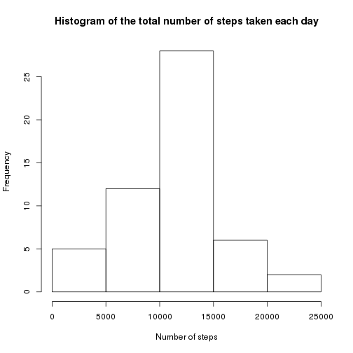
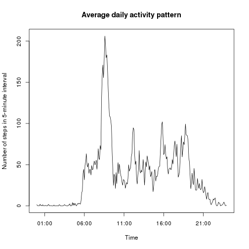
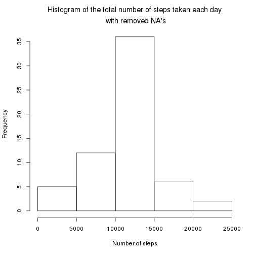
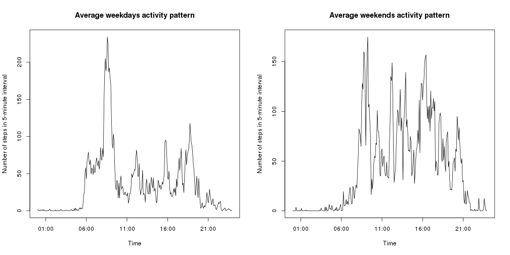

## Loading and preprocessing the data

```r
# reading data from file and getting summary
activity <- read.csv('activity.csv', colClasses = c('numeric', 'Date', 'numeric'))
summary(activity)
```

```
##      steps             date               interval     
##  Min.   :  0.00   Min.   :2012-10-01   Min.   :   0.0  
##  1st Qu.:  0.00   1st Qu.:2012-10-16   1st Qu.: 588.8  
##  Median :  0.00   Median :2012-10-31   Median :1177.5  
##  Mean   : 37.38   Mean   :2012-10-31   Mean   :1177.5  
##  3rd Qu.: 12.00   3rd Qu.:2012-11-15   3rd Qu.:1766.2  
##  Max.   :806.00   Max.   :2012-11-30   Max.   :2355.0  
##  NA's   :2304
```

```r
# processing data and getting summary
library('stringr')
activity$interval <- str_pad(activity$interval, 4, pad='0')
activity$weekday <- as.factor(weekdays(activity$date))
summary(activity)
```

```
##      steps             date              interval              weekday    
##  Min.   :  0.00   Min.   :2012-10-01   Length:17568       Friday   :2592  
##  1st Qu.:  0.00   1st Qu.:2012-10-16   Class :character   Monday   :2592  
##  Median :  0.00   Median :2012-10-31   Mode  :character   Saturday :2304  
##  Mean   : 37.38   Mean   :2012-10-31                      Sunday   :2304  
##  3rd Qu.: 12.00   3rd Qu.:2012-11-15                      Thursday :2592  
##  Max.   :806.00   Max.   :2012-11-30                      Tuesday  :2592  
##  NA's   :2304                                             Wednesday:2592
```

## What is mean total number of steps taken per day?

```r
library('reshape2')
melted <- melt(activity, id=c('date'), measure.vars='steps', na.rm=TRUE)
result <- dcast(melted, date ~ variable, sum)
hist(result$steps, xlab='Number of steps', main='Histogram of the total number of steps taken each day')
```

 

```r
mean(result$steps)
```

```
## [1] 10766.19
```

```r
median(result$steps)
```

```
## [1] 10765
```

## What is the average daily activity pattern?

```r
library('reshape2')
melted <- melt(activity, id=c('interval'), measure.vars='steps', na.rm=TRUE)
result <- dcast(melted, interval ~ variable, mean)
summary(result)
```

```
##    interval             steps        
##  Length:288         Min.   :  0.000  
##  Class :character   1st Qu.:  2.486  
##  Mode  :character   Median : 34.113  
##                     Mean   : 37.383  
##                     3rd Qu.: 52.835  
##                     Max.   :206.170
```

```r
with(result, plot(strptime(interval, '%H%M'), steps, type='l', xlab='Time', ylab='Number of steps in 5-minute interval', main='Average daily activity pattern'))
```

 

```r
with(result, interval[which(steps == max(steps))])
```

```
## [1] "0835"
```

## Imputing missing values
Number of missing values:

```r
sum(is.na(activity$steps))
```

```
## [1] 2304
```
The strategy for filling gaps is the using median of step value for that interval for all days of observation.

```r
clean_activity <- activity
empty_values_indexes <- which(is.na(activity$steps)) 
for (i in empty_values_indexes){
    interval_value <- activity$interval[i] 
    clean_activity$steps[i] <- with(result, steps[which(interval == interval_value)])
}
library('reshape2')
melted <- melt(clean_activity, id=c('date'), measure.vars='steps', na.rm=TRUE)
result <- dcast(melted, date ~ variable, sum)
hist(result$steps, xlab='Number of steps', main=expression(atop("Histogram of the total number of steps taken each day", " with removed NA's")))
```

 

## Are there differences in activity patterns between weekdays and weekends?

```r
library('reshape2')
melted <- melt(subset(activity, !(weekday %in% c('Saturday', 'Sunday'))), id=c('interval'), measure.vars='steps', na.rm=TRUE)
weekdays <- dcast(melted, interval ~ variable, mean)
melted <- melt(subset(activity, weekday %in% c('Saturday', 'Sunday')), id=c('interval'), measure.vars='steps', na.rm=TRUE)
weekends <- dcast(melted, interval ~ variable, mean)
par(mfrow=c(1, 2))
with(weekdays, plot(strptime(interval, '%H%M'), steps, type='l', xlab='Time', ylab='Number of steps in 5-minute interval', main='Average weekdays activity pattern'))
with(weekends, plot(strptime(interval, '%H%M'), steps, type='l', xlab='Time', ylab='Number of steps in 5-minute interval', main='Average weekends activity pattern'))
```

 

```r
#title('Differences in activity patterns between weekdays and weekends')
```
